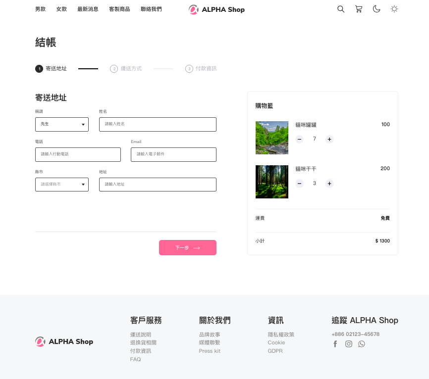

# Alpha Shop Website


## Introduction

This project was developed using React. 
It is a mock-up of an online shop that showcases the checkout processes and the products in the cart. 
You can easily navigate between steps by clicking on the next or previous button, and modify the quantity of the products by using the plus and minus buttons.


## Getting Started

1. Please ensure that npm and Node.js have been installed in the environment.
2. Clone the project to local repository.
   ```
   $ git clone https://github.com/Yoruyeh/alpha_shop.git 
   ```
3. Use terminal to open the file in local, and input below instruction:
    ```
    $ npm install
    ```
4. Input below instruction after the install:
    ```
    $ npm start
    ```
5. The webpage will be opened in 'http://localhost:3000' automatically, if you see below message in terminal:
    ```
    webpack compiled successfully
    ```
6. If you would like to stop using the website:
    ```
    ctrl + c
    ```

## Devloper Tools

* Node.js v14.18.1
* React 18.2.0
* Sass
