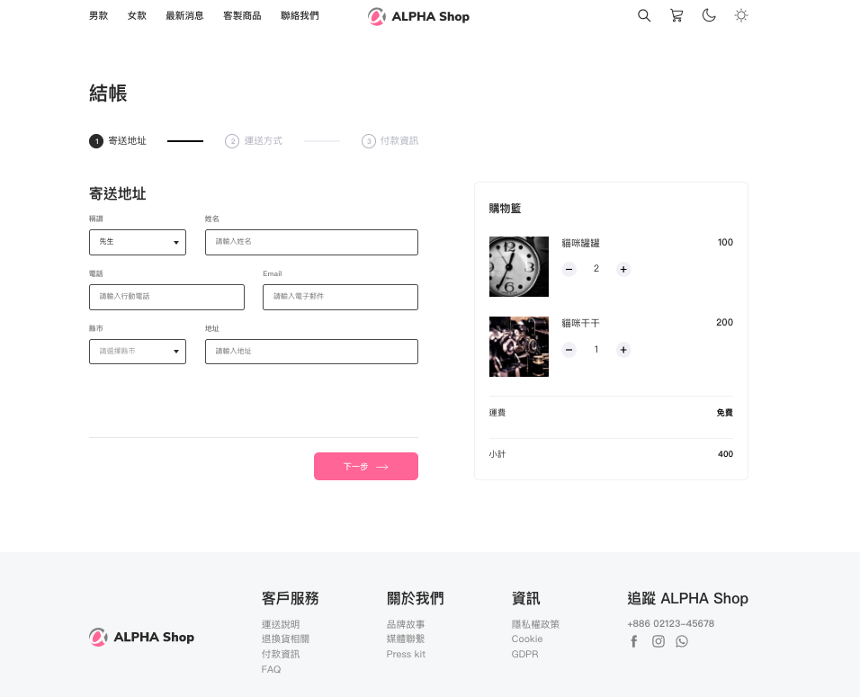

# Alpha Shop Website


## Introduction

This project was built by React, and has only a static webpage so far.

## Getting Started

1. Please ensure that npm and Node.js have been installed in the environment.
2. Clone the project to local repository.
   ```
   $ git clone https://github.com/Yoruyeh/alpha_shop.git 
   ```
3. Use terminal to open the file in local, and input below instruction:
    ```
    $ npm install
    ```
4. Input below instruction after the install:
    ```
    $ npm start
    ```
5. The webpage will be opened in 'http://localhost:3000' automatically, if you see below message in terminal:
    ```
    webpack compiled successfully
    ```
6. If you would like to stop using the website:
    ```
    ctrl + c
    ```

## Devloper Tools

* Node.js v14.18.1
* React 18.2.0
* Sass
